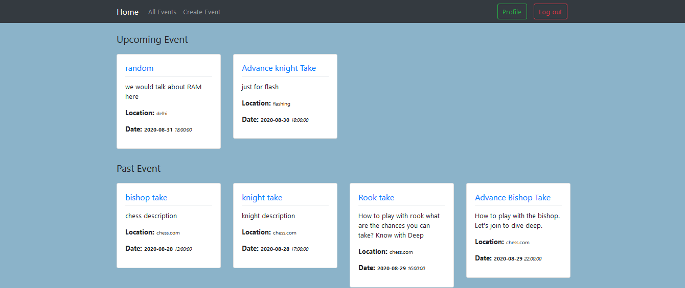

# Members-only

In this project, I built a site similar to a private Eventbrite which allows users to create events and then manage user signups. Users can create events and send invitations and parties. Events take place at a specific date and at a location.
      

<div align="center">

[](https://github.com/Dipeshtwis/private-events)
[](https://github.com/Dipeshtwis/private-events/issues)
[](https://github.com/Dipeshtwis/private-events/pulls)

</div>

## 📝 Contents

<p align="center">
<a href="#with">Built with</a>&nbsp;&nbsp;&nbsp;|&nbsp;&nbsp;&nbsp;
<a href="#sc">Screenshot</a>&nbsp;&nbsp;&nbsp;|&nbsp;&nbsp;&nbsp;
<a href="#gs">Getting started</a>&nbsp;&nbsp;&nbsp;|&nbsp;&nbsp;&nbsp;
<a href="#author">Author</a>
</p>

## 🔧 Built with<a name = "with"></a>

- Ruby on Rails (Version: 6.0.3.2)
- Ruby (Version: 2.7.1)

## Screenshot <a name = "sc"></a>




## Getting Started <a name = "gs"></a>

To get a local copy of the repository please run the following commands on your terminal:

```
$ cd <folder>
```

~~~bash
$ git clone git@github.com:Dipeshtwis/private-events.git
$ cd private-events
$ bundle install
$ yarn install --check-files
$ rails db:migrate
~~~

~~~
In case your test migrate does not happen, run this command

$  rails db:migrate RAILS_ENV=test

## To run Test

~~~ruby
$ ruby -Itest test/integration/create_users_controller_test.rb
$ ruby -Itest test/models/event_test.rb
$ ruby -Itest test/models/user_test.rb

~~~


## ✒️  Authors <a name = "author"></a>


👤 **Dipesh Kumar**

- Github: [@Dipeshtwis](https://github.com/Dipeshtwis)
- Twitter: [@97deepeshkumar](https://twitter.com/97deepeshkumar)
- Linkedin: [dipeshtwis](https://www.linkedin.com/in/dipeshtwis/)


## 🤝 Contributing

Contributions, issues and feature requests are welcome!

Feel free to check the [issues page](https://github.com/Dipeshtwis/private-events/issues).


## 👍 Show your support

Give a ⭐️ if you like this project!

## :clap: Acknowledgements

- Microverse: [@microverse](https://www.microverse.org/)
